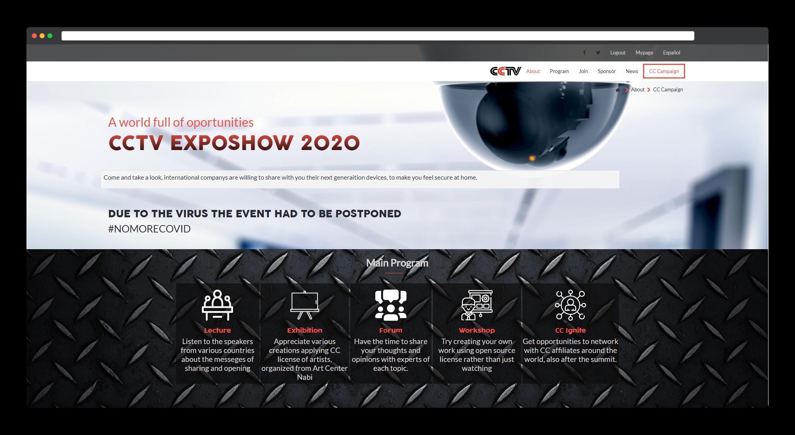
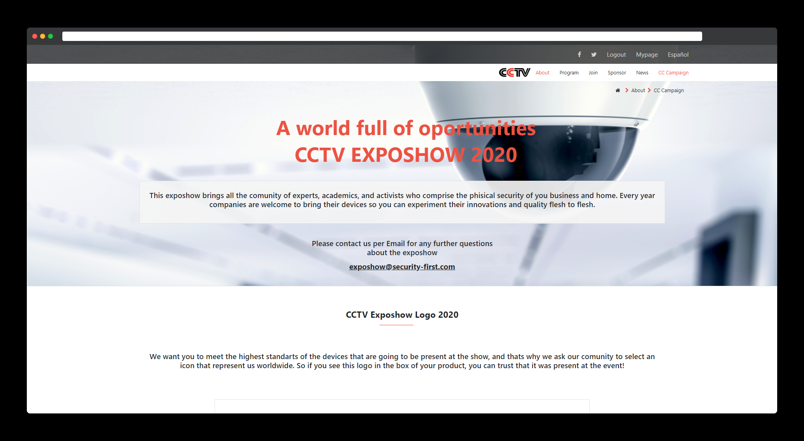
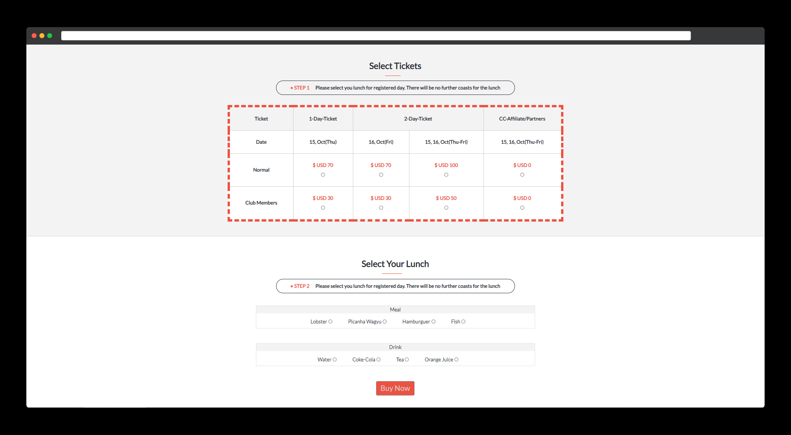

# HTML-CSS Capstone Project 

> In this project we had to use everything we already learn and a bit more to fulfill the requirements, following the initial instructions i acomplished this website. 

## Built With

- HTML
- CSS
- Git
- Bootstrap

## Live Demo

[Live Demo Link](https://carloso0114.github.io/HTML-CSS-Capstone-Project/)

## How to run it

To get a local copy up and running follow these simple steps.

* If you're using latest version of git.

* Clone this url https://github.com/carloso0114/HTML-CSS-Capstone-Project on your local host.

* You have to use a Web explorer browser like Google Chrome or Mozilla Firefox to open the index.html file.

## Authors

👨‍💻 **Carlos Ospina**

- GitHub: [@carloso0114](https://github.com/carloso0114)
- Twitter: [Carlos_Osp1](https://twitter.com/Carlos_Osp1)
- LinkedIn: [Carlos Ospina](https://www.linkedin.com/in/carlos-ospina-242b831a6/)

## Show your support

Give a ⭐️ if you like this project!
